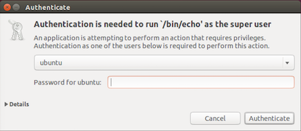

## Electron subprocess with administrative privileges

Run a subprocess with administrative privileges, prompting the user with a graphical OS dialog if necessary. Useful for background subprocesse which run native Electron apps that need sudo.

- `Windows`, uses native ```User Account Control (UAC)``` (no ```PowerShell``` required)
- `OS X`, uses bundled applet (inspired by  [Joran Dirk Greef](https://github.com/jorangreef))
- `Linux`, uses system pkexec or gksudo (system or bundled).




## Features
  - Supports ```spawn``` and ```exec``` subprocess behavior
  - Supports applications packaged as ```asar``` archive
  - Separate password prompt for each call (use ```sh``` or ```bat``` script for single prompt)
  - No external dependencies, does not depend on OS versions

## Installation
```
npm install electron-sudo
```

## Usage
**Note: Your command should not start with the ```sudo``` prefix.**

### Version 4.0.*

```js
import Sudoer from 'electron-sudo';

let options = {name: 'electron sudo application'},
    sudoer = new Sudoer(options);

/* Spawn subprocess behavior */
let cp = await sudoer.spawn(
  'echo', ['$PARAM'], {env: {PARAM: 'VALUE'}}
);
cp.on('close', () => {
  /*
    cp.output.stdout (Buffer)
    cp.output.stderr (Buffer)
  */
});

/* Exec subprocess behavior */
let result = await sudoer.exec(
  'echo $PARAM', {env: {PARAM: 'VALUE'}}
);
/* result is Buffer with mixed (both stdout and stderr) output */

```

### Version 3.0.* (deprecated)

```js
var sudo = require('electron-sudo');
var options = {
  name: 'Your application name',
  icns: '/path/to/icns/file' // (optional, only for MacOS),
  process: {
    options: {
      // Can use custom environment variables for your privileged subprocess
      env: {'VAR': 'VALUE'}
      // ... and all other subprocess options described here
      // https://nodejs.org/api/child_process.html#child_process_child_process_exec_command_options_callback
    },
    on: function(ps) {
      ps.stdout.on('data', function(data) {});
      setTimeout(function() {
        ps.kill()
      }.bind(ps), 50000);
    }
  }
};
sudo.exec('echo hello', options, function(error) {});
```

## Tests
```
npm i && npm test
```

## Usage with Webpack

Webpack config should contain ```__dirname``` equals ```true``` for work properly

```js

let nodeModules = fs.readdirSync('./node_modules')
    .filter((module) => {
        return module !== '.bin';
    })
    .reduce((prev, module) => {
        return Object.assign(prev, {[module]: 'commonjs ' + module});
    }, {});

export default {
    ...
    target: 'electron',
    node: {
        /* http://webpack.github.io/docs/configuration.html#node */
        __dirname: true
    },
    externals: nodeModules
};
```

## Platform-specific sources

- [Applet [OSx]](https://github.com/automation-stack/electron-sudo/tree/master/darwin/applet.app/Contents)
- [Elevate.exe sources [Win32/64]](https://github.com/automation-stack/electron-sudo/tree/master/win32/src)
- [GKsu sources [Linux]](https://github.com/automation-stack/electron-sudo/tree/master/linux)

If you don't trust binaries bundled in NPM package you can manually build tools and use them instead.
