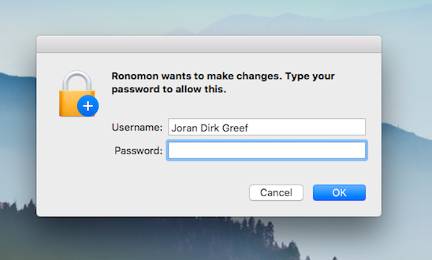
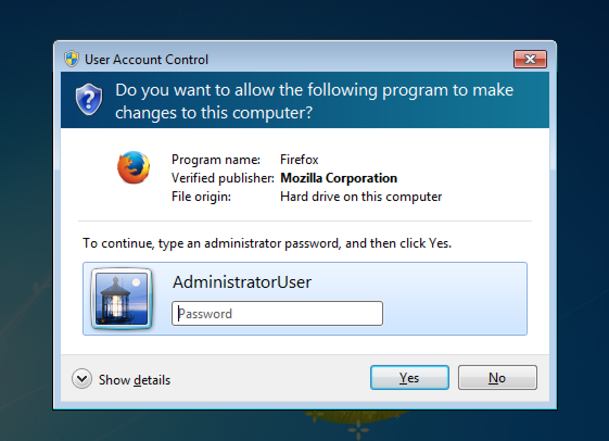
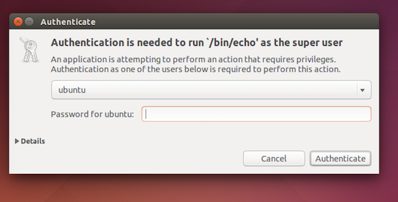
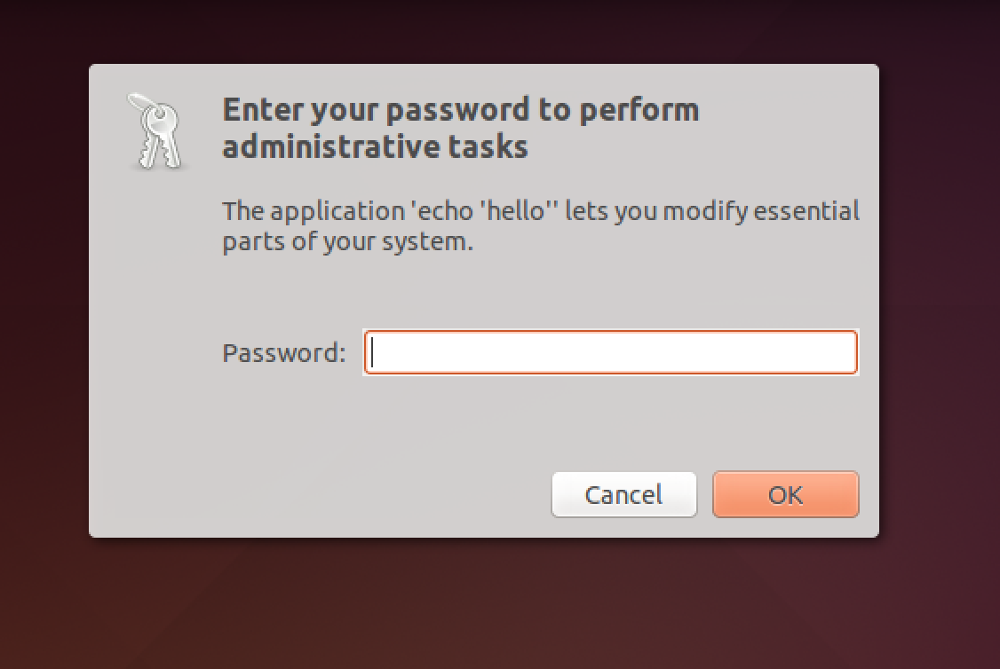

# sudo-dialog

Run a subprocess with administrative privileges, prompting the user with a graphical OS dialog if necessary. Useful for background Node.js applications or native Electron apps that need sudo.





On Linux we try to use system pkexec, gksudo or kdesudo, if it not found then use bundled gksu.




`sudo-dialog` provides a native OS dialog prompt on **OS X** and **Linux (beta)** with custom name and optional icon.

`sudo-dialog` has no external dependencies and does not require any native bindings.

## Installation
```
npm install sudo-dialog
```

## Usage
Note: Your command should not start with the `sudo` prefix.
```
var sudo = require('sudo-dialog');
var options = {
  name: 'Ronomon',
  icns: '/path/to/icns/file' // (optional)
};
sudo.exec('echo hello', options, function(error) {});
```

`sudo-dialog` will use `process.title` as `options.name` if `options.name` is not provided. `options.name` must be alphanumeric only (spaces are supported) and at most 70 characters.

*Please note that `sudo.setName()` and `sudo.touch()` have been deprecated to provide a completely functional interface to `exec()`. These calls will be removed in the next release of `sudo-dialog`.*

## Behavior
- ```OS X```, `sudo-dialog` should behave just like the `sudo` command in the shell. If your command does not work with the `sudo` command in the shell (perhaps because it uses `>` redirection to a restricted file), then it will not work with `sudo-dialog`. However, it is still possible to use sudo-dialog to get a privileged shell.

*Please note that Linux support is currently in beta and requires more testing across Linux distributions.*

- ```Linux```, `sudo-dialog` will use embedded `gksu` to show the password prompt and run your command. Where possible, `sudo-dialog` will try and get these to mimic `sudo` as much as possible (for example by preserving environment), but your command should not rely on any environment variables or relative paths, in order to work correctly. Depending on which binary is used, and due to the limitations of some binaries, the name of your program or the command itself may be displayed to your user.

Just as you should never use `sudo` to launch any graphical applications, you should never use `sudo-dialog` to launch any graphical applications. Doing so could cause files in your home directory to become owned by root. `sudo-dialog` is explicitly designed to launch non-graphical terminal commands. For more information, [read this post](http://www.psychocats.net/ubuntu/graphicalsudo).

## Concurrency
- ```OS X```, you can issue multiple calls to `sudo.exec` concurrently, and `sudo-dialog` will batch up multiple permission requests into a single password prompt. These calls will be batched to the extent that they share the same `options.name` and `options.icns` arguments (including the actual content of `options.icns` if provided).

- ```Linux```, `sudo` usually has `tty-tickets` enabled. This prevents `sudo-dialog` from batching up multiple permission requests, and will result in a separate password prompt for each call.

- ```Windows```, `sudo` usually use VBS for elevating needed right with UAC. This prevents `sudo-dialog` from batching up multiple permission requests, and will result in a separate password prompt for each call.

While `sudo-dialog` may batch up calls, you should never rely on `sudo-dialog` to execute your calls in order. For example, several calls may be waiting on a password prompt, and the next call after the password prompt may execute before any of these calls. If you need to enforce ordering of calls, then you should explicitly order your calls in your application.
